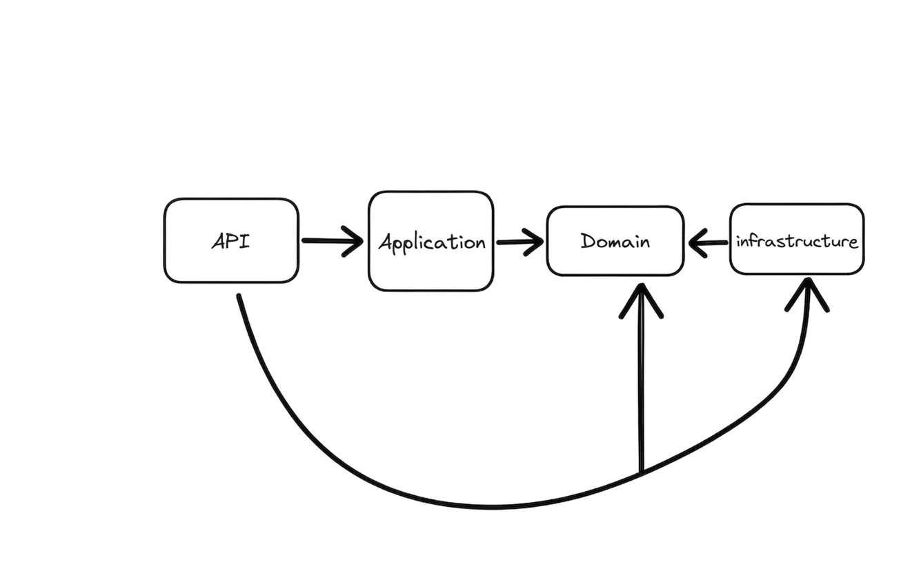
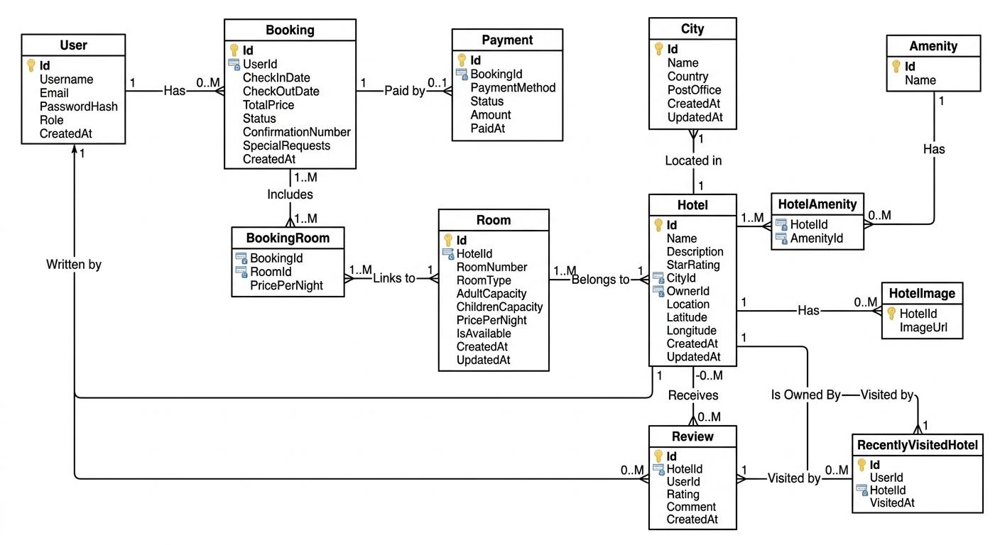

## Final Project: Travel and Accommodation Booking Platform

### Architecture

This project follows **Clean Architecture** to maintain separation of concerns, improve testability, and make the system easier to maintain and extend.

### Database Schema

The database is designed to support hotel management, room availability, bookings, users, payments, reviews, amenities, and related booking functionality.

